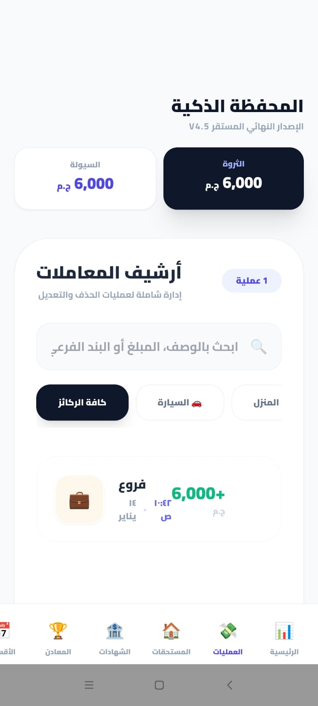
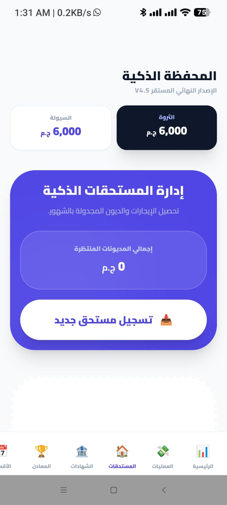
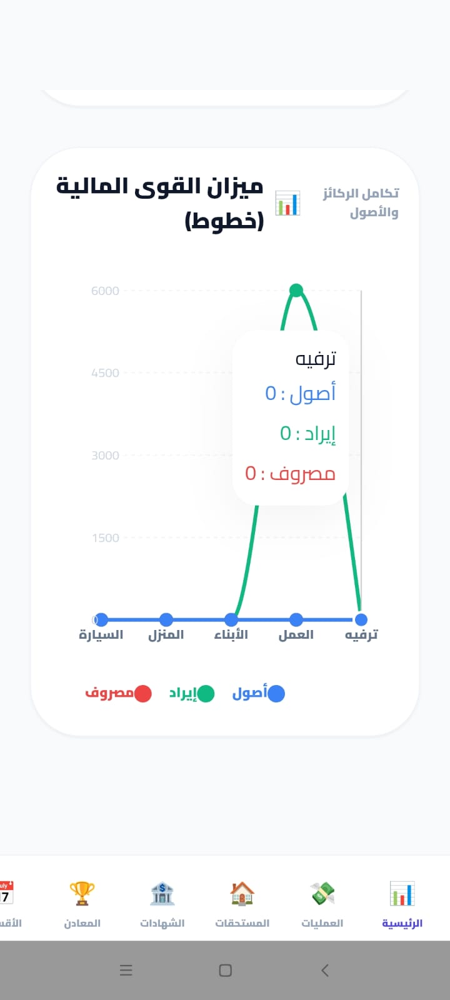
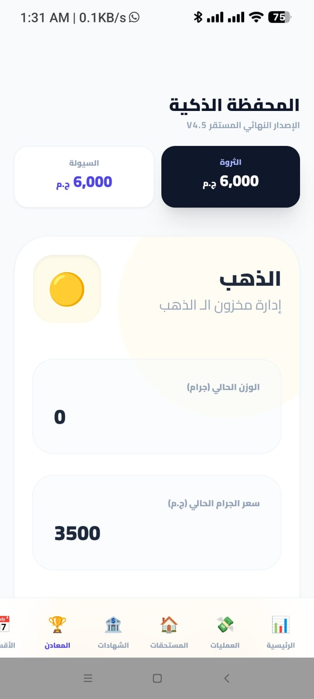
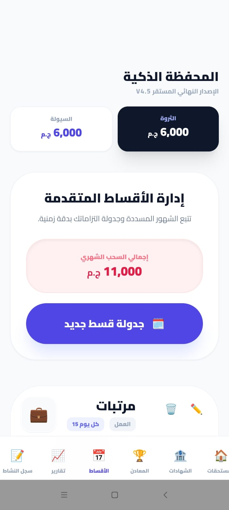
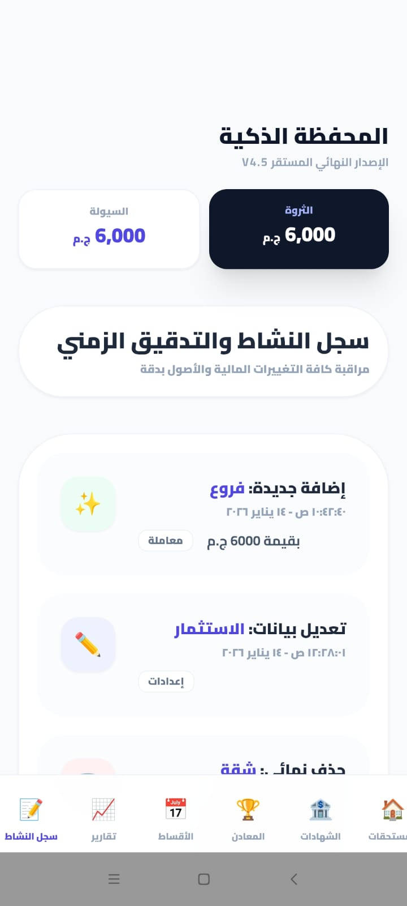
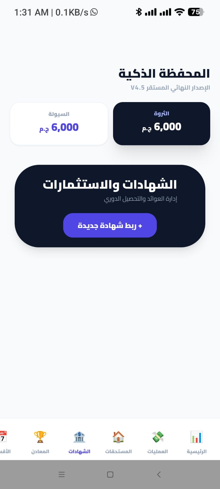
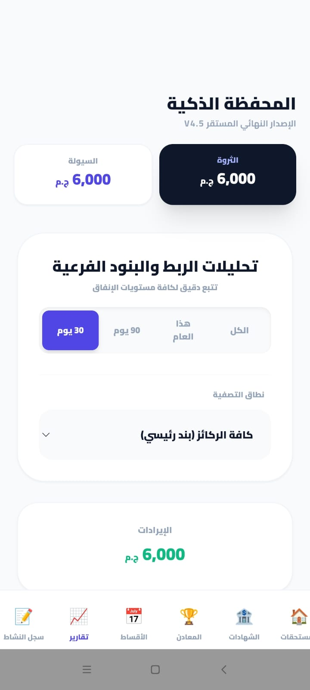
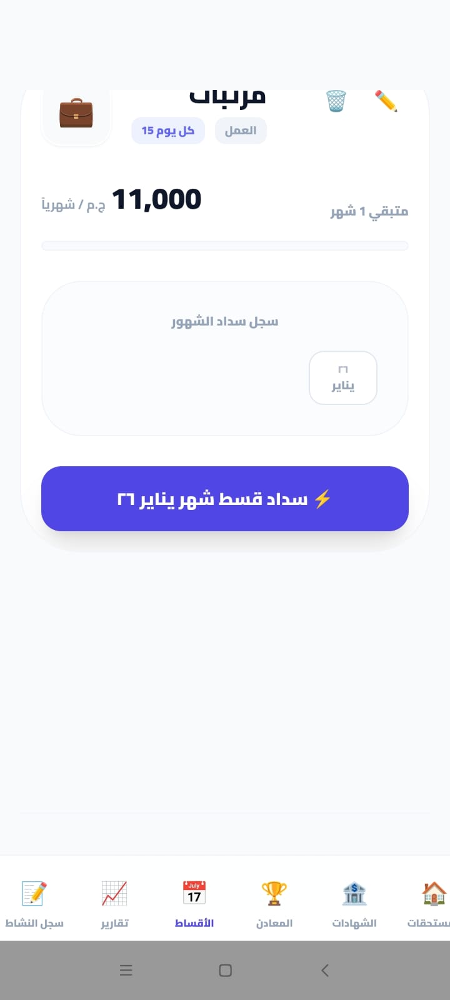

# smart-wallet-v4.0
smart-wallet-v4.0
# 💳 Smart Wallet V4.0 - المساعد المالي والذكاء الاستثماري
### نظام متكامل لإدارة الثروات، تتبع الديون، ورصد المعادن الثمينة

تعد **المحفظة الذكية** وحدة برمجية متطورة مصممة للمستخدم الطموح الذي يسعى للتحكم الكامل في تدفقاته المالية واستثماراته، مع توفير أقصى درجات الأمان والخصوصية.

---

## 🌟 الميزات الجوهرية (Core Features)

### 1. إدارة التدفقات النقدية (Cash Flow)
* **تتبع الحركات:** تسجيل لحظي لكافة المصروفات والإيرادات مع تصنيفها الذكي.
* **التقارير المالية:** عرض تقارير دورية شاملة تسمح بالحذف أو التعديل لضمان دقة البيانات.

### 2. الديون والالتزامات (Debts & Receivables)
* **المستحقات الخارجية:** سجل خاص بالأموال التي لك عند الآخرين مع نظام جدولة زمني.
* **إدارة الأقساط:** تتبع الديون الشخصية والأقساط الشهرية مع توضيح الشهور المسددة والمتبقية بشكل مرئي.

### 3. الاستثمارات والشهادات البنكية
* **إدارة الشهادات:** إضافة الشهادات البنكية وتحديد دورية العائد.
* **الحساب التلقائي:** يتم حساب الفوائد المتوقعة بناءً على النسبة المئوية والمدة الزمنية وفق المعادلة:
  $$I = P \times r \times t$$

### 4. رصد الثروات (Gold & Silver Tracking)
* **التقييم اللحظي:** تتبع مدخراتك من الذهب والفضة بجميع العيارات.
* **التسعير التلقائي:** يقوم النظام بتقييم قيمة ثروتك المعدنية بناءً على **سعر السوق الحالي** وتوفير تقارير حول تطور قيمتها.

---

## 🧠 الذكاء المالي والتنبيهات
* **المستشار الاستثماري:** نظام منبه ذكي يحلل وضعك المالي:
    * **في حالة الفائض:** يقترح عليك فرصاً استثمارية بناءً على المبلغ المتاح.
    * **في حالة العجز:** ينبهك بضرورة تقليص المصروفات لتغطية الالتزامات القادمة.

---

## 🛡️ نظام الأمان والخصوصية (Triple-Layer Security)
لحماية بياناتك المالية الحساسة، تم دمج ثلاث طبقات من الحماية:
1. **Biometric Auth:** الدخول ببصمة الإصبع أو الوجه.
2. **Pattern Lock:** نظام الرسم (النقش) كطبقة حماية ثانية.
3. **Internal PIN:** كلمة مرور إضافية خاصة بالمحفظة من داخل البرنامج.

---

## 💾 النسخ الاحتياطي (Backup & Restore)
* **Local Backup:** إمكانية عمل نسخة احتياطية كاملة لكافة البيانات المالية وتشفيرها وحفظها محلياً.
* **Restore:** استعادة البيانات في أي وقت لضمان عدم ضياع سجلاتك المالية عند تغيير الهاتف.

---

## 🖼️ معرض الصور (Demo)
| | | |
|:---:|:---:|:---:|

  
  
  
  
  
  
  
  
  
  
   

   
   🚀 البدء (Getting Started)
للحصول على نسخة محلية من المشروع وتجربتها على جهازك، قم بفتح الـ Terminal وتنفيذ الأمر التالي:

Bash
git clone https://github.com/HanyArnous/smart-wallet-v4.0.git

## Demo Apk

[Download Demo APK](https://www.mediafire.com/file/i3soe3oxsyq3ixr/app-release-unsigned.apk/file
